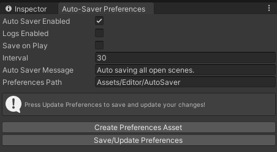

  

  <h3 align="center">Auto-Saver</h3>

  

    A tool for Unity that auto-saves in a specified amount of time and on play mode state change.
     
    <a href="https://github.com/AndrejStojkovic/unity-autosaver/issues">Report bug or Request a feature</a>
  

## Table of contents

- [Quick start](#quick-start)
- [Prerequisites](#prerequisites)
- [Preview](#preview)
- [Bugs, feature requests and contributing](#bugs-feature-requests-and-contributing)
- [Copyright and license](#copyright-and-license)

## Quick start

- Copy contents from Assets/Editor folder into your Unity project in the same specified location
- In the menu item bar, Tools > AutoSaver
- Done

## Prerequisites

- Install the package Editor Couroutines (com.unity.editorcoroutines)

## Preview

## Bugs, feature requests and contributing

Have a bug or a feature request? Please first read the [issue guidelines](https://reponame/blob/master/CONTRIBUTING.md) and search for existing and closed issues. If your problem or idea is not addressed yet, [please open a new issue](https://reponame/issues/new).

## Copyright and license

Code and documentation copyright 2023 the authors (Andrej Stojkovikj). Code released under the [MIT License](https://github.com/AndrejStojkovic/unity-autosaver/blob/master/LICENSE).

Logo and art copyright 2023 under Andrej Stojkovikj and not available for personal or commercial use. Contact the author for more info.

Enjoy :metal:
